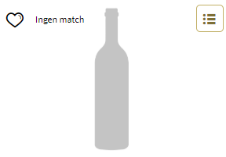
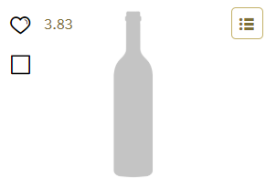
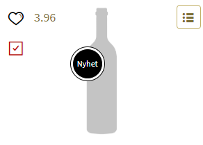

# Vinmonopolet Untappd Linker

## Table of Contents

- [Vinmonopolet Untappd Linker](#vinmonopolet-untappd-linker)
  - [Table of Contents](#table-of-contents)
  - [About The Project](#about-the-project)
    - [Built With](#built-with)
  - [Getting Started](#getting-started)
    - [Prerequisites](#prerequisites)
    - [Installation](#installation)
    - [Build](#build)
  - [Updating the database](#updating-the-database)
  - [License](#license)

## About The Project

|           No match           |          Not had before           |         Had Before         |
| :--------------------------: | :-------------------------------: | :------------------------: |
|  |  |  |

Finding good beers in the Vinmonopolet online store is a tedious task. You need to find the best beers and preferably some new ones. This extensions links vinmonopolet with untappd so that you can see what ratings the beers and whether you have had them directly in the product listing.

### Built With

- [JQuery](https://jquery.com)

## Getting Started

### Prerequisites

In order to run the `oppdaterdatabase.py` script you need to install:

- `pandas`
- `pyperclip`

### Installation

The latest version is always available at the Chrome Web Store and packaged under releases.

### Build

There is no need to build the extension at this time.

## Updating the database

The link between Vinmonopolet and Untappd has to be manually generated.
In order to update the links when new products are added to Vinmonopolet you can manually edit `db.json` or run the supplied `oppdaterdatabase.py` script which makes the whole process easier.
Feel free to open a PR if you have added or updated some links.

## License

Distributed under the MIT License. See `LICENSE` for more information.